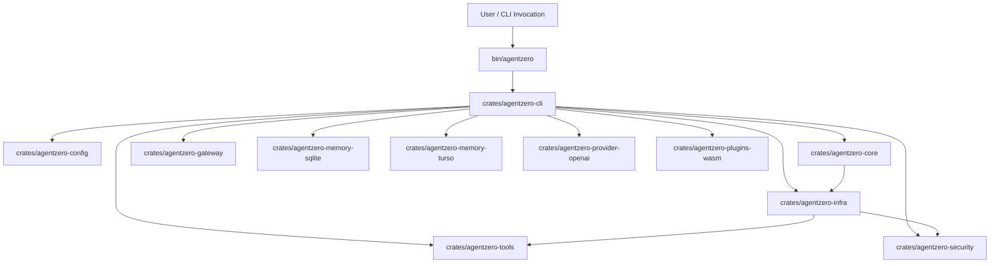
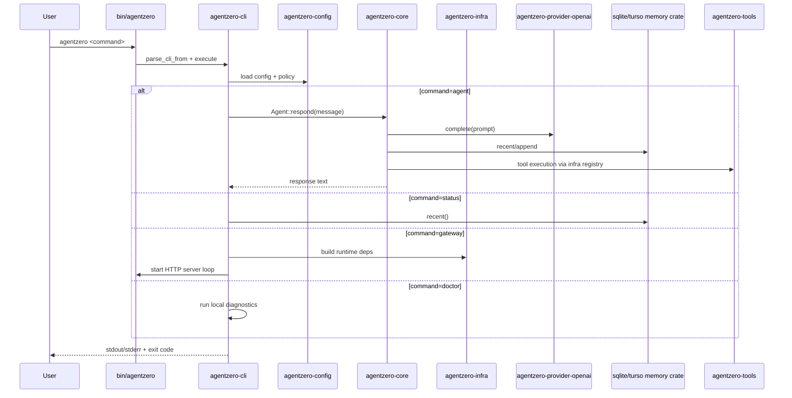

# Architecture

This document provides a high-level view of the current `agentzero` runtime and crate boundaries.

## Crate Diagram

## Command Execution Flow

## Current Responsibilities

- `bin/agentzero`: Thin executable entrypoint and process exit behavior.
- `agentzero-cli`: Command parsing, command dispatch, UX, diagnostics, and orchestration glue.
- `agentzero-config`: Typed config model, validation, dotenv/env/file layering, policy loading.
- `agentzero-core`: Agent domain loop and trait-driven orchestration.
- `agentzero-provider-openai`: OpenAI-compatible provider implementation and retry/error mapping.
- `agentzero-memory-sqlite`: Default local memory backend.
- `agentzero-memory-turso`: Optional remote/libsql memory backend.
- `agentzero-tools`: Hardened tool implementations (`read_file`, `write_file`, `shell`) with policy gates.
- `agentzero-security`: Redaction and security policy utilities used by infra/runtime paths.
- `agentzero-infra`: Integration layer for provider/memory/tool wiring and optional plugin/mcp tools.
- `agentzero-gateway`: HTTP service surface for runtime access and health/ping.
- `agentzero-plugins-wasm`: WASM plugin preflight/runtime policy checks.

## Security Boundaries

- Tool execution is policy-gated from config (`[security.*]`) and fails closed by default.
- Optional capabilities (`write_file`, `mcp`, process plugins) require explicit enablement.
- Audit events can be enabled via `[security.audit]` for traceability of execution steps.
- Config validation enforces bounded values and safe URL/path constraints before runtime execution.

## Notes

- The CLI crate currently contains runtime orchestration glue that is planned to move into a dedicated runtime crate in a later sprint (`agentzero-runtime`).
- Doctor diagnostics are currently CLI-local checks; deeper daemon/scheduler freshness checks are tracked in Sprint 11.
