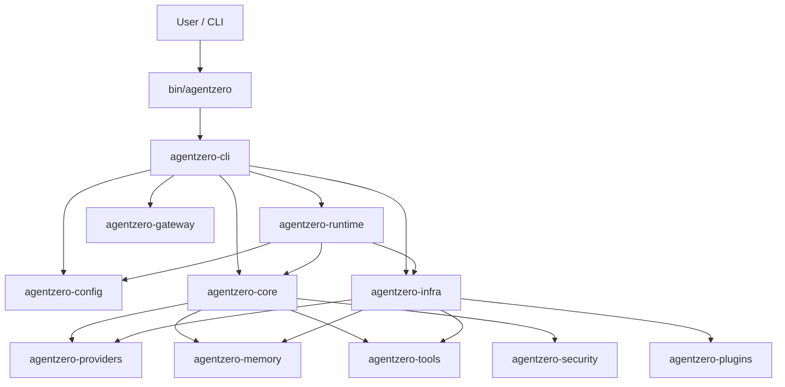
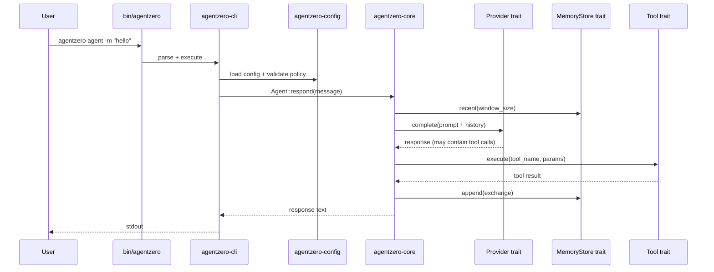

This document provides a high-level view of the AgentZero runtime architecture.

## Design Principles

1. **Traits define boundaries.** Core crate has zero infrastructure dependencies.
2. **Fail closed.** Security defaults deny everything; capabilities require explicit opt-in.
3. **Single binary.** One `cargo install` gives you CLI, gateway, daemon, and all tools.
4. **Crate isolation.** Each subsystem lives in its own crate with minimal dependencies.

## Crate Diagram

## Workspace Crates (34)

| Crate | Purpose |
|---|---|
| `bin/agentzero` | Thin binary entrypoint |
| `agentzero-cli` | Command parsing, dispatch, and UX |
| `agentzero-core` | Agent traits, orchestrator, and domain types |
| `agentzero-config` | Typed config model and policy validation |
| `agentzero-runtime` | Runtime orchestration for agent flows |
| `agentzero-providers` | OpenAI-compatible provider implementation |
| `agentzero-memory` | SQLite + Turso memory backends |
| `agentzero-tools` | Built-in tool implementations |
| `agentzero-security` | Policy enforcement, redaction, audit |
| `agentzero-infra` | Wiring layer (connects traits to implementations) |
| `agentzero-gateway` | HTTP gateway (Axum) |
| `agentzero-channels` | Channel trait + messaging implementations |
| `agentzero-plugins` | WASM plugin host + packaging |
| `agentzero-skills` | Skillforge + SOP engine |
| `agentzero-daemon` | Daemon runtime state + lifecycle |
| `agentzero-service` | OS service lifecycle (systemd/OpenRC) |
| `agentzero-health` | Health/freshness assessment |
| `agentzero-heartbeat` | Encrypted heartbeat persistence |
| `agentzero-doctor` | Diagnostics collection |
| `agentzero-cron` | Scheduled task engine |
| `agentzero-hooks` | Lifecycle hooks |
| `agentzero-cost` | Cost tracking primitives |
| `agentzero-coordination` | Runtime coordination |
| `agentzero-goals` | Goals management |
| `agentzero-rag` | Local retrieval index |
| `agentzero-multimodal` | Media-kind inference |
| `agentzero-hardware` | Hardware discovery (feature-gated) |
| `agentzero-peripherals` | Peripheral registry (feature-gated) |
| `agentzero-integrations` | External integration catalog |
| `agentzero-crypto` | Cryptographic primitives |
| `agentzero-storage` | Persistent key-value store |
| `agentzero-update` | Self-update and migration |
| `agentzero-common` | Shared helpers and types |
| `agentzero-auth` | Subscription auth profiles |
| `agentzero-testkit` | Test doubles and mocks |
| `agentzero-bench` | Criterion benchmark suite |

## Command Execution Flow

## See Also

- [Security Boundaries](/agentzero/security/boundaries/) — Layered defense-in-depth model
- [Trait System](/agentzero/architecture/traits/) — Detailed trait interfaces and crate boundaries
- [Config Reference](/agentzero/config/reference/) — Full annotated `agentzero.toml`
- [Threat Model](/agentzero/security/threat-model/) — Security threat analysis
