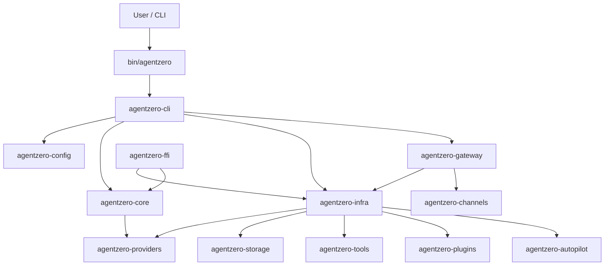
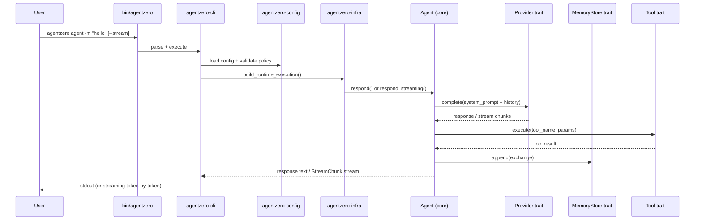

This document provides a high-level view of the AgentZero runtime architecture.

## Design Principles

1. **Traits define boundaries.** Core crate has zero infrastructure dependencies.
2. **Fail closed.** Security defaults deny everything; capabilities require explicit opt-in.
3. **Single binary.** One `cargo install` gives you CLI, gateway, daemon, and all tools.
4. **Crate isolation.** Each subsystem lives in its own crate with minimal dependencies.

## Crate Diagram

## Workspace Crates (20 members)

The workspace was consolidated from 46 to 16 library crates plus a thin binary, the lightweight orchestrator, the test kit, and the macros crate — 20 members total. Each corresponds to a real deployment or consumption boundary.

| Crate | Purpose |
|---|---|
| `bin/agentzero` | Thin binary entrypoint |
| `bin/agentzero-lite` | Lightweight orchestrator (~5.8 MB release-min binary) for resource-constrained edge deployments |
| `agentzero-cli` | Command parsing, dispatch, UX (absorbed 18 modules: daemon, doctor, health, hooks, service, etc.) |
| `agentzero-core` | Agent traits, orchestrator, domain types, security, delegation, routing, **device capability detection**, **retrieval ranking primitives** |
| `agentzero-config` | Typed config model and policy validation |
| `agentzero-providers` | LLM provider implementations (Anthropic, OpenAI-compatible, Candle local, llama.cpp builtin) |
| `agentzero-auth` | Credential management (OAuth, API keys, profiles) |
| `agentzero-storage` | Encrypted KV store + conversation memory (SQLite, Turso, SQLCipher) + **HNSW vector index** |
| `agentzero-tools` | 57+ built-in tool implementations (includes autonomy, hardware, cron, skills) |
| `agentzero-infra` | Agent orchestration, audit, runtime execution, tool wiring |
| `agentzero-orchestrator` | Multi-agent coordination, swarm routing, pipeline integration |
| `agentzero-autopilot` | Autonomous company loop — proposals, cap gates, missions, triggers, reaction matrices (feature-gated) |
| `agentzero-channels` | Platform integrations (Telegram, Discord, Slack) + leak guard |
| `agentzero-plugins` | WASM plugin host runtime (wasmi default, wasmtime optional) |
| `agentzero-plugin-sdk` | Plugin SDK (ABI v2, WASI) |
| `agentzero-gateway` | HTTP/WebSocket server (Axum) with SSE streaming + **Tantivy BM25** (when `rag` feature enabled) |
| `agentzero-ffi` | FFI bindings (Swift/Kotlin/Python via UniFFI, Node via napi-rs) |
| `agentzero-config-ui` | Embedded config UI (feature-gated) |
| `agentzero-macros` | `#[tool]`, `#[tool_fn]`, `#[derive(ToolSchema)]` proc macros |
| `agentzero-testkit` | Test doubles and mocks (dev-only) |

## Command Execution Flow

## Observability

AgentZero provides three layers of observability:

**Tracing** — Provider calls are instrumented with `tracing` spans (`anthropic_complete`, `openai_stream`, etc.) that carry `provider` and `model` fields. Request/response/retry events are logged at `info!`/`warn!` level via `transport.rs` helpers.

**Metrics** — The gateway exposes Prometheus counters (`requests_total`, `errors_total`, `ws_connections_total`), histograms (`request_duration_seconds`), and gauges (`active_connections`) at `/metrics`.

**Circuit Breaker** — Each Anthropic provider instance has a circuit breaker that tracks consecutive failures and transitions through closed/open/half-open states. State transitions are logged at `info!` level. The `CircuitBreakerStatus` struct exposes `state_label()` and `failure_count()` for health checks.

## Self-Evolving Runtime

AgentZero grows smarter over time through three persistence mechanisms:

| Store | File | What It Remembers |
|---|---|---|
| **Dynamic Tools** | `.agentzero/dynamic-tools.json` | Tools created at runtime (shell, HTTP, LLM, composite strategies) |
| **Agent Store** | `.agentzero/agents.json` | Persistent agents defined from natural language |
| **Recipe Store** | `.agentzero/tool-recipes.json` | Successful tool combos indexed by goal keywords |

All stores are encrypted at rest via `EncryptedJsonStore`. The system loads them at startup and updates them during execution. This means:

- A tool created in session 1 is available in session 5
- An agent defined last week routes messages automatically this week
- A tool combo that worked for "video summarization" boosts the right tools for "podcast transcription"

The `GoalPlanner` decomposes natural language goals into multi-agent DAGs, the `HintedToolSelector` combines planner hints + recipe matches + keyword matching, and the `ToolSource` trait enables mid-session tool discovery.

## Capability-Based Security (Sprint 86)

`ToolSecurityPolicy` now carries a `capability_set: CapabilitySet` field alongside the legacy
`enable_*` boolean flags. When `capability_set.is_empty()` (the default for all existing configs),
all permission decisions fall back to the boolean flags — existing `agentzero.toml` files are
completely unaffected.

When a `[[capabilities]]` array is present in config, the `CapabilitySet` drives all tool
permission checks. Key properties:

- **Deny overrides grant** — explicit denials always win.
- **Empty means fall back** — backward compatible with all existing configs.
- **Child never exceeds parent** — `CapabilitySet::intersect()` is used when building
  sub-agent policies during delegation.

See [Configuration Reference](/config/reference/#capabilities) for TOML examples and the
migration guide.

## See Also

- [Security Boundaries](/security/boundaries/) — Layered defense-in-depth model
- [Trait System](/architecture/traits/) — Detailed trait interfaces and crate boundaries
- [Config Reference](/config/reference/) — Full annotated `agentzero.toml`
- [Threat Model](/security/threat-model/) — Security threat analysis
